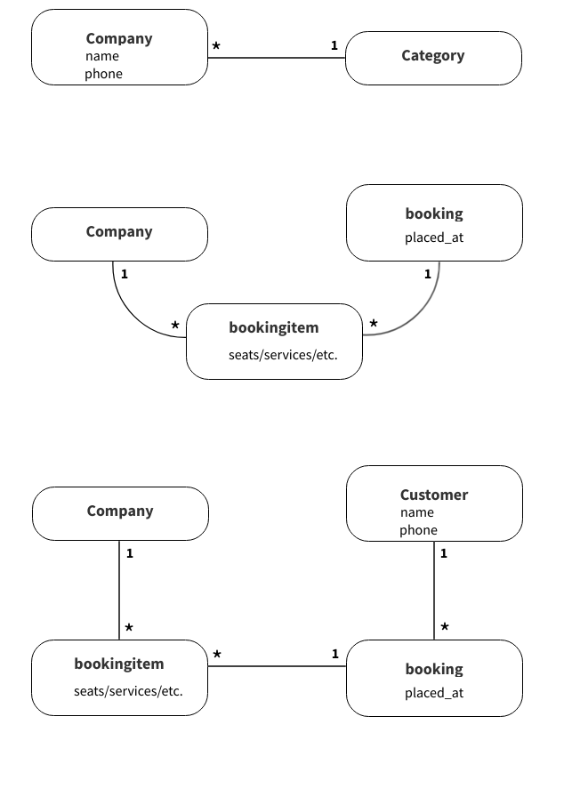

# The 4th Project Portfolio of CI

## Bookable

Project URL: [View live project](https://mt-bookable.herokuapp.com "Bookable")

 

## User stories

  -  ### As an <strong>Admin User</strong> I can:

      1. add, edit & delete a company so that the platform stays high quality.
      2. approve or disapprove a company so that only serious companies are on the platform.
      3. view all registered companies so that the platform stays up to date.
      4. search and filter through all companies so that to quickly find the company I'm searching for.

       

  -  ### As a <strong>Company User</strong> I can:

      1. create a profile to receive appointments so that customer acquisition is easier & straightforward.
      2. edit or delete my profile so that my profile can stay updated or remove myself from the platform.
      3. approve or disapprove a user appointment so that I am in control of the appointments.
      3. view all confirmed bookings so that I can find an appointment if needed.
      4. search and filter through all bookings so that to quickly find a specific booking.
      5. delete bookings after a specific time that are no longer relevant so that the booking list stays clean and uncluttered.

       

  -  ### As an <strong>Unregistered User</strong> I can:

      1. view relevant company information so that the information is easily digestible.
      2. easily book an appointment so that making an appointment is fast.
      3. cancel an appointment so that spots are released again.

       

## Table of Contents

* [Planes](#planes)
    * [The Surface](#surface)
    * [Skeleton](#skeleton)
    * [Structure](#structure)
    * [Scope](#scope)
    * [Strategy](#strategy)
* [Development](#development)
    * [HTML](#dev-html)
    * [CSS](#dev-css)
    * [Python](#dev-python)
    * [Testings](#testings)
    * [Bugs](#bugs)
* [Validator](#validator)
* [Deployment](#deployment)
    * [Fork](#fork)
    * [Clone](#clone)
    * [Deploy](#deploy)
* [Credits](#credits)

 

## Planes

 

### Surface

<!-- What will the product actually look like, what colors, what typography, what images/design elements, what animation, what transitions, how will the final product look like? -->

#### Wireframe

| Mobile | Desktop |
|:--------:|:--------:|
|  |  |

 

-   #### Colour Scheme

    -

    | #HEX | Color |
    |:--------:|:--------:|
    | # ||

     

    #### Typography

    -    is used to give the app a ....

     

-   #### Imagery

    -   The purpose of the images is to make the app more appealing.
    -   The colors and images all serve to be aligned with and assist in the app's branding.
    -   The images also intend to give the app an identity the user can relate to, lifting its overall impression.

     

    -   Favicon image:

     

    

     

    -   Social image card:

     

    

 

### Skeleton

<!-- (How the infomation implemented), (how will the user navigate), (how the content relate to each other, low, mid top priority, how and where to position content)? -->

 

### Structure

<!-- How is the information, logically grouped, the feature the elements the data? -->

For the initial design of this Django project, I chose a monolith design because of the size of this project.

As seen below, the initial data model built for this project laid the foundation for how the app should work.

 

### Scope

<!-- What features,(nvp), both ability and desires? -->

#### Minimum viable product

The minimum this app should include:

1. The ability to register as a company without market boundaries.
2. The ability to add relevant company information.
3. The ability to add products/services etc.
4. The ability to accept bookings without customer accounts.
5. The ability for companies to manage their bookings.

 

#### Desired features

The desired features this would want:

1. The ability to separate between private & company booking makers.

 

### Strategy

<!-- Aiming to achieve and for whom? -->

The app is targeted towards any service providers from dentists to spa and restaurants, to make their bookings easiler to accept and manage.

 

## Development

#### Languages Used

- [HTML](https://en.wikipedia.org/wiki/HTML "Wikipedia's HTML page")
- [CSS3](https://en.wikipedia.org/wiki/Cascading_Style_Sheets "Wikipedia's CSS3 page")
- [JavaScript](https://en.wikipedia.org/wiki/JavaScript "Wikipedia's JavaScript page")
- [Python](https://en.wikipedia.org/wiki/Python_(programming_language) "Wikipedia's Python page")

 

### Frameworks, Libraries & Programs Used

 

1. [Mockflow:](https://mockflow.com/ "mockflow.com")
    - Mockflow was used to create the wireframes during the design process.
2. [Git:](https://git-scm.com/ "git-scm.com")
    - Git was used for version control by utilizing the Gitpod terminal to commit to Git and Push to GitHub.
3. [GitHub:](https://github.com/ "github.com")
    - GitHub is used to store the project's code after being pushed from Git.
4. [Heroku:](https://www.heroku.com "heroku.com")
    - Heroku is a container-based cloud Platform as a Service (PaaS). Developers use Heroku to deploy, manage, and scale modern apps. Project is hosted on Heroku for viewing and interacting with the app.
5. [Django](https://en.wikipedia.org/wiki/Django_(web_framework) "wikipedia.com")
    - Django is a high-level Python web framework that encourages rapid development and clean, pragmatic design.
6. [VisualStudioCode](https://code.visualstudio.com "https://code.visualstudio.com")
    - Visual Studio Code is a code editor redefined and optimized for building and debugging modern web and cloud applications.
7. [DATAGrip](https://www.jetbrains.com/datagrip/ "https://www.jetbrains.com")
    - DataGrip, a database IDE that is tailored to suit the specific needs of professional SQL developers.
8. [django-debug-toolbar](https://pypi.org/project/django-debug-toolbar/ "https://pypi.org")
    - The Django Debug Toolbar is a configurable set of panels that display various debug information about the current request/response and when clicked, display more details about the panel’s content.

     

### Dev HTML

 

### Dev CSS

 

### Dev Django

From the very beginning of the project, it was essential to differentiate between the development and production environments.

That is why I chose to opt for a common settings file for the project and separate dev/prod files inheriting everything from common but each with their variables depending on where the app is running.

I moved and renamed the settings.py file and made the necessary changes to the dependencies.

 

 

## Testings

From the beginning, I did manual testing and debugging throughout the project's development. A tool that came in handy was the django-debug-toolbar extension that I have come to love.

### Python Code

[Testings.md]()

### Lighthouse

 

### Accessibility

The app was tested with [color.a11y.com/Contrast](https://color.a11y.com/Contrast/ "color.a11y.com/Contrast") for any accessability issues.

 

The social card image was tested with [brandwood.com/a11y/](https://www.brandwood.com/a11y/ "brandwood.com/a11y/") for any accessability issues.

 

### Bugs

I have grown fond of eliminating bugs found in my code as I intentionally try to provoke and find them.

 

 

## Validator

### Validate Python

I ran all Python code against PEP8's online checker with no errors reported. See screenshots here: [pep8]()

 

## Deployment

 

### Fork

How to fork this repository:

1. Log in to GitHub and navigate to [this repository](https://github.com/MTraveller/bookable).
2. You'll see a button called <b>Fork</b> on the top right side of the page. Click the button to create a copy of this repository to your own GitHub account.

 

### Clone

How to clone this project:

1. Under the repository’s name, click on the <b>Code</b> button.
2. In the <b>HTTPS</b> tap, click on the clipboard icon to copy the given URL.
3. In your IDE of choice, open <b>**git bash**</b>.
4. Change the current working directory to where you want the cloned directory to be.
5. Type <b>**git clone**</b>, paste the URL copied from GitHub - https://github.com/MTraveller/bookable.git.
6. Press <b>**enter**</b>, and you are done.

 

### Deploy

To deploy the app to Heroku, navigate to [Heroku.com](https://www.heroku.com "heroku.com") and login into your account or create one if needed. Upon entering your dashboard, create a new app and set the location.

 

## Credits

 

### Sources Used

[Python Docs](https://docs.python.org/3.10/ "docs.python.org")

 

## Acknowledgement

No code within this project is a copy unless specified explicitly in the source code—Code Institute provided the base template for this project. The sources used above provided guidance throughout the development.

This project is part of the "Full Stack Software Developer Diploma" at [Code Institute](https://codeinstitute.net/).

MT 2022.

[Back to top](#the-4th-project-portfolio-of-ci)