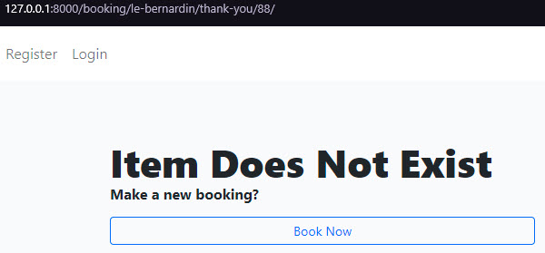

# The 4th Project Portfolio of CI

## Bookable

Project URL: [View live project](https://mt-bookable.herokuapp.com "Bookable")

A simple Django website for any company to accept bookings.

 

## Table of Contents

* [Planes](#planes)
    * [The Surface](#surface)
    * [Skeleton](#skeleton)
    * [Structure](#structure)
    * [Scope](#scope)
    * [Strategy](#strategy)
* [Development](#development)
    * [HTML](#dev-html)
    * [CSS](#dev-css)
    * [Python](#dev-python)
    * [Testings](#testings)
    * [Bugs](#bugs)
* [Validator](#validator)
* [Deployment](#deployment)
    * [Fork](#fork)
    * [Clone](#clone)
    * [Deploy](#deploy)
* [Credits](#credits)

 

## Planes

### Surface

-   #### Wireframes

    | Page | Link |
    |:--------:|:--------:|
    | Home | [Home](./docs/planes/surface/wireframes/home-page.png) |
    | Contact | [Contact](./docs/planes/surface/wireframes/contact-page.png) |
    | Message sent | [Message sent](./docs/planes/surface/wireframes/message-sent.png) |
    | Signup | [Signup](./docs/planes/surface/wireframes/signup-page.png) |
    | Login | [Login](./docs/planes/surface/wireframes/login-page.png) |
    | Company info form | [Company info form](./docs/planes/surface/wireframes/company-info-form.png) |
    | Company account | [Company account](./docs/planes/surface/wireframes/company-account-page.png) |
    | Company booking page | [Company booking page](./docs/planes/surface/wireframes/company-booking-page.png) |
    | Company booking thank you | [Company booking thank you](./docs/planes/surface/wireframes/company-booking-thank-you-page.png) |

 

-   #### Colour Scheme

    

    3 main colours were used #05284D for brand name & footer, #007BFF for buttons and #F9FAFC for main content background. I used olive, yellow, and red for minor things.

     

-   #### Typography

    -   [Lato](https://fonts.google.com/specimen/Lato "fonts.google.com") is used on the brand name in the header/navigation bar, which gives the brand a nice touch.
    -   For the rest, system font is used throughout the pages, which the user is already familiar with, to keep the site lightweight.

     

-   #### Imagery

    -   The purpose of the images is to make the app more appealing.
    -   The colors and images all serve to be aligned with and assist in the app's branding.
    -   The images also intend to give the app an identity the user can relate to, lifting its overall impression.

     

    Screenshots were taken of the site and added to the homepage as highlights.

    As a paying customer of Envato elements, I can download images, etc., with licenses.

    -   The homepage and the contact page both have an image from Envato elements.

     

    

     

    -   The homepage has icons from Envato elements.

     

    

     

    -   Favicon image:

     

    

     

    -   Social image card:

     

    

 

-   #### Finished Product

| Page | Medium | |
|:--------:|:--------:|:--------:|
| Homepage | [Desktop](./docs/planes/surface/finished-product/homepage-desktop.jpeg) | [Mobile](./docs/planes/surface/finished-product/homepage-mobile.jpeg) |
| Contact | [Desktop](./docs/planes/surface/finished-product/contact-page-desktop.jpeg) | [Mobile](./docs/planes/surface/finished-product/contact-page-mobile.jpeg) |
| Message Sent | [Desktop](./docs/planes/surface/finished-product/message-sent-page-desktop.jpeg) | [Mobile](./docs/planes/surface/finished-product/message-sent-page-mobile.jpeg) |
| Login | [Desktop](./docs/planes/surface/finished-product/login-page-desktop.jpeg) | [Mobile](./docs/planes/surface/finished-product/login-page-mobile.jpeg) |
| Signup | [Desktop](./docs/planes/surface/finished-product/signup-page-desktop.jpeg) | [Mobile](./docs/planes/surface/finished-product/signup-page-mobile.jpeg) |
| Logout | [Desktop](./docs/planes/surface/finished-product/logout-page-desktop.jpeg) | [Mobile](./docs/planes/surface/finished-product/logout-page-mobile.jpeg) |
| Add Company Info | [Desktop](./docs/planes/surface/finished-product/add-company-info-page-desktop.jpeg) | [Mobile](./docs/planes/surface/finished-product/add-company-info-page-mobile.jpeg) |
| Company Account | [Desktop](./docs/planes/surface/finished-product/company-account-page-empty-desktop.jpeg) | [Mobile](./docs/planes/surface/finished-product/company-account-page-empty-mobile.jpeg) |
| Company Account Delete | [Desktop](./docs/planes/surface/finished-product/company-account-delete-page-desktop.jpeg) | [Mobile](./docs/planes/surface/finished-product/company-account-delete-page-mobile.jpeg) |
| Company Account Empty | [Desktop](./docs/planes/surface/finished-product/company-account-page-empty-desktop.jpeg) | [Mobile](./docs/planes/surface/finished-product/company-account-page-empty-mobile.jpeg) |
| Company Account Info | [Desktop](./docs/planes/surface/finished-product/company-account-page-edit-desktop.jpeg) | [Mobile](./docs/planes/surface/finished-product/company-account-page-edit-mobile.jpeg) |
| Company Info Edit | [Desktop](./docs/planes/surface/finished-product/company-info-edit-page-desktop.jpeg) | [Mobile](./docs/planes/surface/finished-product/company-info-edit-page-mobile.jpeg) |
| Company Booking | [Desktop](./docs/planes/surface/finished-product/company-booking-page-desktop.jpeg) | [Mobile](./docs/planes/surface/finished-product/company-booking-page-mobile.jpeg) |
| Booking Thank You | [Desktop](./docs/planes/surface/finished-product/thank-you-desktop.jpeg) | [Mobile](./docs/planes/surface/finished-product/thank-you-mobile.jpeg) |
| Customer Booking Delete | [Desktop](./docs/planes/surface/finished-product/customer-booking-delete-page-desktop.jpeg) | [Mobile](./docs/planes/surface/finished-product/customer-booking-delete-page-mobile.jpeg) |
| Error 404 | [Desktop](./docs/planes/surface/finished-product/404-page-desktop.jpeg) | [Mobile](./docs/planes/surface/finished-product/404-page-mobile.jpeg) |

-   There are templates for error pages 400, 401, 403, 404, and 500.

 

### Skeleton

#### Admin

-   Admin can control all categories, companies, customers, and more.

    

     

-   The admin can approve and disapprove a company in the company model and filter by the status.

    

     

-   In addition to the company model view, by pressing the User ID Number, the admin is redirected to that specific user. Categories view has the same but will add a filter for all companies inside that particular category.

#### All pages

-   A fixed top navbar that is easily accessible at all times on all pages.

    

     

    If a user is signed in, the navbar changes with the account, logout links, and displays the user's name.

    

     

-   Footer is visible on all pages.

    

     

#### Homepage

-   A hero section below the navbar quickly informs the user about the site.

    

     

-   A section below the hero section speaks about **Why Bookable**, which tries to build the brand's confidence.

     

-   Below "Why" section there's three feature sections that comes in handy, they speak about the app features.

    

     

-   Below the features section, there's a call to action section that invites the visitor to either register or lead the visitor to the contact page.

     

#### Contact

-   On the homepage, the Website will greet the visitor with a hero section, and below it, a contact form the vill presented to the visitor for easy contact.

     

#### Account page

-   The account page is simple and contains a small header with a greeting and the user's name, and across it is an offcanvas button. Below the header, there's a booking list table and a pagination bar at the bottom.

    

     

    Pressing the offcanvas button will bring out the info section with all information about the user and two buttons at the bottom; edit the company info or delete the account and everything associated with it.

    

     

#### Booking page

-   The booking page is to the point, with the essential things a customer would want—a form to book and quick & small snippets of info about the company.

    

     

#### Thank you page

-   The thank you page is simple, with helpful information to all parties if shared.

    

 

### Structure

For the initial design of this Django project, I chose a monolith design because of the size of this project.

The data model built for this project laid the foundation for how the app should work.

 

A database diagram from the Datagrip program:

 

CRUD for this project is as follows:

| User | Create | Read | Update | Delete |
|:--------:|:--------:|:--------:|:--------:|:--------:|
| Admin | Yes | Yes | Yes | Yes |
| Company | Yes | Yes | Yes | Yes |
| Site user | Yes | Yes | No | Yes |

An explanation for CRUD for each user:

- Admin can create, read, update and delete users, companies, and site users.
- Company can create a user and company profile and read, update & delete their information.
- Site users can create, read & delete a booking the user made.

 

#### Security

Bookable heavily uses `request.user.is_authenticated` and acts accordingly on every view and template. I tried to tighten things up as much as possible for the code with checks at every corner.

 

### Scope

This project is without email capabilities, and I did not see the need for it. This project is just an illustration of a general booking app. It is a future desired feature.

#### Minimum viable product

The minimum this app should include:

1. The ability to register as a company without market boundaries.
2. The ability to add relevant company information.
3. The ability to have a company booking page.
4. The ability to accept bookings without customer accounts.
5. The ability to see all bookings.
6. The ability for booking makers to delete/cancel their booking.

#### Desired features

The desired features this would want:

1. The ability to receive booking confirmation emails.
2. The ability for companies to manage their bookings.
3. The ability to add products/services etc.
4. The ability to separate between private & company booking makers.

 

### Strategy

#### App Goal:

- The app is targeted toward service providers, from dentists to spas and restaurants, to make their bookings easier to accept and manage.

#### Agile Development:

- Agile development methodology was used for this project, planning, developing, and delivering in small sprints. There were three sprints in total spaced out over one month with:
  - the admin epic, 1/3 of the total time.
  - the company epic, 1/2 of the total time.
  - the customer epic, 1/3 of the total time

 

I assigned all epics labels:
- must have
- should have
- could have

I prioritized all epics according to their labeling.
- I did "must-have" first.
- Then "should have"
- While "could have" was not developed due to the deadline of this project.
- "Nice to have" was not used for this project as that list could quickly grow beyond this project's scope.

The Kanban board used was created using Github projects and can be seen [here](https://github.com/MTraveller/bookable/projects/1 "Kanban board")

#### Epics

The project has three primary epics, each supplementing the previous. Also, I did testing in each epic, related bugs, errors, etc., were fixed, and related front-end user reporting was created, i.e., a 404 error page.

I did final testing of everything after the completion of the epics.

 

Epic 1 - Admin with data model setup

- The foundation of the app going forward. The data model for all epics was developed, then the admin portion of the app.

 

Epic 2 - Company User

The main epic took up most of the time as the whole app was based around this epic.

 

Epic 3 - Site User

The last and final epic brought together the company and booking models.

#### User Stories

 

The following user stories contain the epics above.

 

- #### Epic 1
    - As an <strong>Admin User</strong> I can:
        1. User stories 1 & 3 combined
            1. - [x] https://github.com/MTraveller/bookable/issues/1 add, edit & delete a company so that the platform stays high quality.
            2. - [x] https://github.com/MTraveller/bookable/issues/3 view all registered companies so that the platform stays up to date.
        3. - [x] https://github.com/MTraveller/bookable/issues/2 approve or disapprove a company so that only serious companies are on the platform.
        4. - [x] https://github.com/MTraveller/bookable/issues/4 search and filter through all companies so that to quickly find the company I'm searching for.

    - Developed
        | Sprint | Developed |
        |:--------:|:--------:|
        | a |Yes|
        | b |Yes|
        | c |Yes|

 

- #### Epic 2
    - As a <strong>Company User</strong> I can:
        1. - [x] https://github.com/MTraveller/bookable/issues/5 create a profile to receive appointments so that customer acquisition is easier & straightforward.
        2. - [x] https://github.com/MTraveller/bookable/issues/6 edit or delete my profile so that my profile can stay updated or remove myself from the platform.
        3. - [ ] https://github.com/MTraveller/bookable/issues/7 approve or disapprove a user appointment so that I am in control of the appointments.
        4. - [x] https://github.com/MTraveller/bookable/issues/8 view all confirmed bookings so that I can find an appointment if needed.
        5. - [ ] https://github.com/MTraveller/bookable/issues/9 search and filter through all bookings so that to quickly find a specific booking.
        6. - [ ] https://github.com/MTraveller/bookable/issues/10 delete bookings after a specific time that are no longer relevant so that the booking list stays clean and uncluttered.

         

    - Developed
        | Sprint | Developed |
        |:--------:|:--------:|
        | a |Yes|
        | b |Yes|
        | c |No|
        | d |Yes|
        | e |No|
        | f |No|

 

- #### Epic 3
    - As an <strong>Unregistered Site User</strong> I can:
        1. - [x] https://github.com/MTraveller/bookable/issues/11 view relevant company information so that the information is easily digestible.
        2. - [x] https://github.com/MTraveller/bookable/issues/12 easily book an appointment so that making an appointment is fast.
        3. - [x] https://github.com/MTraveller/bookable/issues/13 cancel an appointment so that spots are released again.

         

    - Developed
        | Sprint | Developed |
        |:--------:|:--------:|
        | a |Yes|
        | b |Yes|
        | c |Yes|

 

## Development

#### Languages Used

- [HTML](https://en.wikipedia.org/wiki/HTML "Wikipedia's HTML page")
- [CSS3](https://en.wikipedia.org/wiki/Cascading_Style_Sheets "Wikipedia's CSS3 page")
- [JavaScript](https://en.wikipedia.org/wiki/JavaScript "Wikipedia's JavaScript page")
- [Python](https://en.wikipedia.org/wiki/Python_(programming_language) "Wikipedia's Python page")

 

### Dev HTML

Django infused with HTML; now that's powerful. Using template tags is so much fun with custom template tags. That's where the power is.

 

### Dev CSS

I didn't utilize custom CSS very much as this whole project uses Bootstrap 5.2 classes, and I'll say this; It was awesome!

 

### Dev Django

WoW Django, what is there not to say? Luckily Django pushed me outside my comfort zone more than I could imagine. It's enormous, yet now that I've been through this project, I feel I have just scratched the surface. One thing is sure; I learned a great deal about Django; I even dabbled in making a custom tag. It was fun.

From the very beginning of the project, it was essential to differentiate between the development and production environments.

That is why I chose to opt for a shared settings file and separate dev/prod files inheriting everything else, each with its variables depending on where the app is running. I moved and renamed the settings.py file and made the necessary changes to the dependencies.

Cloudinary wasn't straightforward, and I think integration with Django could be better. I could be missing something, and with the deadline coming up, unfortunately, I got no more time to dabble in Cloudinary.

As always, regex comes in handy.

#### Views

I opted in for and used Django's base view class `View` as the base of all views. I know there's `CreateView`, `ListView`, `DetailView`, `UpdateView`, and `DeleteView`, which seems a cleaner way to do it. That would be a future desire to refactor all views into generic class-based views.

Django until we meet again :)

 

## Testings

From the beginning, I did manual testing and debugging throughout the project's development. A tool that came in handy was the django-debug-toolbar extension, which I have come to love.

**[Testings.md](./testings.md "Tests")**

### Lighthouse

I've tested numerous pages with lighthouse, and the result is somewhat similar, with a very tiny difference in performance. The tests showed identical readings to the image below. I chose to screenshot the booking page as that was the heaviest of them all.

 

### Accessibility

The app was tested with [color.a11y.com/Contrast](https://color.a11y.com/Contrast/ "color.a11y.com/Contrast") for any accessability issues. Bootstraps btn-outline-light class was the leading cause. I fixed all problems.

I tested other pages as well.

 

The social card image was tested with [brandwood.com/a11y/](https://www.brandwood.com/a11y/ "brandwood.com/a11y/") for any accessability issues. Issues for the small text did show up, but given that this image would show up on social media when shared, I chose to leave it as is to entice people to visit the site.

 

### Bugs

I have grown fond of eliminating bugs found in my code as I intentionally try to provoke and find them.

 

This one is more of a warning than a bug for that specific query.

   - For this warning I added order_by to the booking model.

 

The booking URL object id-URL bug when a user deletes a booking, the below page comes up.

   - Notice /thank-you/88/ at the end. The request should render the below image but instead renders the company.

 

   - Adding a condition to check whether /booking/<slug:slug>/ is the same as request.path solved the bug.

 

   - Changing href="/static/... to href="cloudinary url" fixed the issue.

 

   - Changing href=" to href="cloudinary url" fixed the issue.

 

**Since then I refactored the template tag and reverted back to dynamic urls again.**

   - I've included a button to copy the thank you page URL for sharing. Javascript is used to copy the innerHTML of the `<a>` tag, after which the browser console reports the error in the image above. Adding async await to the function fixed the issue.

## Validators

### HTML

HTML markup were checked with [w3 HTML Checker](https://validator.w3.org/nu/ "https://validator.w3.org/nu/") and issues found were quickly fixed.

 

### CSS

I checked CSS syntax with [Jigsaw](https://jigsaw.w3.org/css-validator/ "https://jigsaw.w3.org/css-validator/") and nothing significant, warnings of 3rd-party extensions. Bookable's styles.css is short, as Bookable uses Bootstrap for styling.

 

### Javascript

I checked the Javascript files with [JSHint](https://jshint.com "https://jshint.com"), and there were warning about missing colons. All fixed.

 

### Python

I went through all files, and there were a couple of extra whitespaces, indentation, and long lines reported by [pep8online](http://pep8online.com "http://pep8online.com") checker. All fixed.

 

## Deployment

 

### Fork

How to fork this repository:

1. Log in to GitHub and navigate to [this repository](https://github.com/MTraveller/bookable).
2. You'll see a button called <b>Fork</b> on the top right side of the page. Click the button to create a copy of this repository to your own GitHub account.

 

### Clone

How to clone this project:

1. Under the repository’s name, click on the <b>Code</b> button.
2. In the <b>HTTPS</b> tap, click on the clipboard icon to copy the given URL.
3. In your IDE of choice, open <b>**git bash**</b>.
4. Change the current working directory to where you want the cloned directory to be.
5. Type <b>**git clone**</b>, paste the URL copied from GitHub - https://github.com/MTraveller/bookable.git.
6. Press <b>**enter**</b>, and you are done.

 

### Deploy

To deploy the app to Heroku, navigate to [Heroku.com](https://www.heroku.com "heroku.com") and login into your account or create one if needed. Upon entering your dashboard, create a new app and set the location.

Steps:

1. Click on settings.

2. Click on "Reveal Config Vars"
    * Input the following vars;
        1. CLOUDINARY_CONFIG
            -   In this format with your info:
                cloudinary.config(cloud_name = "xxx",api_key = "xxx",api_secret = "xxx", secure = True)
        2. CLOUDINARY_URL
            -   From your Cloudinary account.
        3. DATABASE_URL
        4. DJANGO_SETTINGS_MODULE
            - bookable.settings.prod
        5. GOOGLE_API_KEY
            - Your google places, map and geocode api.
        6. SECRET_KEY
            - Your Django secret key.

3. Add buildpack.
    * Python.

4. Click on Deploy in the navbar.
    1. Choose deployment method.
    2. if Github, choose repository.
    3. Click "Deploy Branch" at the bottom.

That's it.

 

## Credits

 

### Sources Used

[Python Docs](https://docs.python.org/3.10/ "docs.python.org")

[Django Docs](https://docs.djangoproject.com/en/4.0/ "docs.djangoproject.com")

[Bootstrap 5](https://getbootstrap.com/docs/5.2/getting-started/introduction/ "getbootstrap.com")

[Cloudinary Docs](https://cloudinary.com/documentation/django_integration#landingpage "https://cloudinary.com/")

[Stack Overflow](https://stackoverflow.com/ "stackoverflow.com")

 

### Frameworks, Libraries & Programs Used

 

1. [Mockflow:](https://mockflow.com/ "mockflow.com")
    - Mockflow was used to create the wireframes during the design process.
2. [Git:](https://git-scm.com/ "git-scm.com")
    - I used Git for version control using the Visual Studio Code's terminal to commit to Git and Push to GitHub.
3. [GitHub:](https://github.com/ "github.com")
    - GitHub stores the project's code after being pushed from Git.
4. [Heroku:](https://www.heroku.com "heroku.com")
    - Heroku is a container-based cloud Platform as a Service (PaaS). Developers use Heroku to deploy, manage, and scale modern apps. The project is hosted on Heroku for viewing and interacting with the app.
5. [Django](https://en.wikipedia.org/wiki/Django_(web_framework) "wikipedia.com")
    - Django is a high-level Python web framework that encourages rapid development and clean, pragmatic design.
6. [VisualStudioCode](https://code.visualstudio.com "https://code.visualstudio.com")
    - Visual Studio Code is a redefined code editor optimized for building and debugging modern web and cloud applications.
7. [DATAGrip](https://www.jetbrains.com/datagrip/ "https://www.jetbrains.com")
    - DataGrip is a database IDE tailored to suit professional SQL developers' specific needs.
8. [django-debug-toolbar](https://pypi.org/project/django-debug-toolbar/ "https://pypi.org")
    - The Django Debug Toolbar is a configurable set of panels that display various debug information about the current request/response and, when clicked, display more details about the panel’s content.
9. [Mockaroo](https://www.mockaroo.com/ "https://www.mockaroo.com/")
    - Mockaroo lets you generate up to 1,000 rows of realistic test data in CSV, JSON, SQL, and Excel formats.
10. [Bootstrap5](https://getbootstrap.com/ "https://getbootstrap.com/")
    - CSS Library for faster styling of pages.
11. [Google Places Api](https://developers.google.com/maps/documentation/places/web-service/overview "https://developers.google.com")
    - Library for address autocompletes and google map feature.
12. [Cloudinary](https://cloudinary.com/ "https://cloudinary.com/")
    - A package to make use of and integrate Cloudinary into the application.
13. [dj-database-url](https://pypi.org/project/django-database-url/ "https://pypi.org/project/django-database-url/")
    - This simple Django utility allows you to utilize the 12factor-inspired DATABASE_URL environment variable to configure your Django application.
14. [django-crispy-forms](https://pypi.org/project/django-crispy-forms/ "https://pypi.org/project/django-crispy-forms/")
    - Crispy form makes use of Bootstrap for out-of-the-box styling.
15. [crispy-bootstrap5](https://pypi.org/project/crispy-bootstrap5/ "https://pypi.org/project/crispy-bootstrap5/")
    - A package for crispy forms to use bootstrap 5.
16. [django-phonenumber-field](https://pypi.org/project/django-phonenumber-field/ "https://pypi.org/project/django-phonenumber-field/")
    - A package that verifies the entered string is a phone number.
17. [xdan - datetimepicker](https://github.com/xdan/datetimepicker "https://github.com/xdan/datetimepicker")
    - jQuery DateTimePicker.
18. [Metatags.io](https://metatags.io "https://metatags.io")
    - Metatags.io was used to make the image of the social media card used in this readme.

 

## Acknowledgement

No code within this project is a copy unless specified explicitly in the source code—Code Institute provided the base template for this project. I based the initial base.html template on Code Institutes "I Think Therefore I Blog - base.html template." The sources used above provided guidance throughout the development.

This project is part of the "Full Stack Software Developer Diploma" at [Code Institute](https://codeinstitute.net/).

MT 2022.

[Back to top](#the-4th-project-portfolio-of-ci)