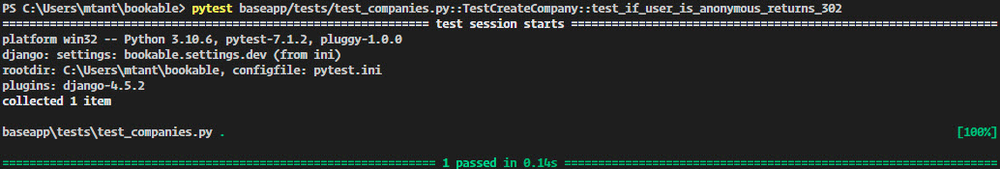
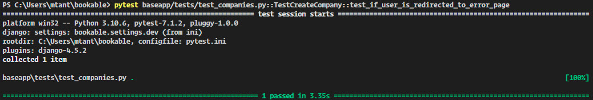
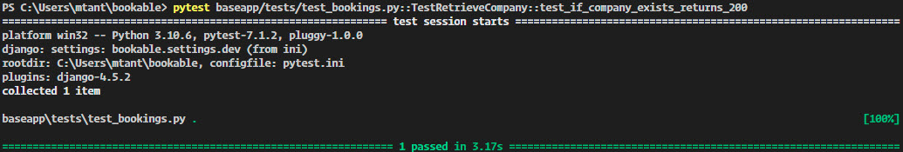
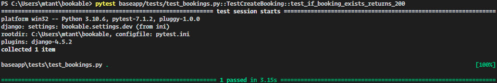

# Testing

## Automated Testing

I used the pytest framework for automated testing, which allowed me to test the application in various ways. pytest is run and installed on the development machine only. I used `pipenv install --dev pytest` with `pipenv install --dev pytest-django` and `pipenv install --dev model_bakery`. Together, there are no limits on what to test.

I tested URL's lookup and creating and retrieving a company and booking object.

 

Function [test_if_user_is_anonymous_returns_302](https://github.com/MTraveller/bookable/blob/6cc2f1afa470b110f850bcf89820cc8d9a56ab15/baseapp/tests/test_companies.py#L18):

-   Tests redirection of anonymous users to homepage.

    

 

Function [test_if_user_is_redirected_to_error_page](https://github.com/MTraveller/bookable/blob/6cc2f1afa470b110f850bcf89820cc8d9a56ab15/baseapp/tests/test_companies.py#L27):

-   Tests the render of company not valid if company add form is not valid.

    

 

Function [test_if_user_is_redirected_to_pending_page](https://github.com/MTraveller/bookable/blob/6cc2f1afa470b110f850bcf89820cc8d9a56ab15/baseapp/tests/test_companies.py#L42):

-   Tests if after company creation renders pending company template.

    

 

Function [test_if_company_does_not_exists_returns_200](https://github.com/MTraveller/bookable/blob/837ba4cf60ba1eaedc86eb192513aa7af6f5d9c0/baseapp/tests/test_bookings.py#L13):

-   Tests the render of company not valid if company does not exist.

    

 

Function [test_if_company_exists_returns_200](https://github.com/MTraveller/bookable/blob/b3d09bf4067b0afe95040c047db16ad21d5a4a95/baseapp/tests/test_bookings.py#L21):

-   Tests creation & retriving of company.

    

 

Function [test_if_booking_exists_returns_200](https://github.com/MTraveller/bookable/blob/b3d09bf4067b0afe95040c047db16ad21d5a4a95/baseapp/tests/test_bookings.py#L42):

-   Tests retriving of thank you page of booking object created.

    

 

## Manual Testing

