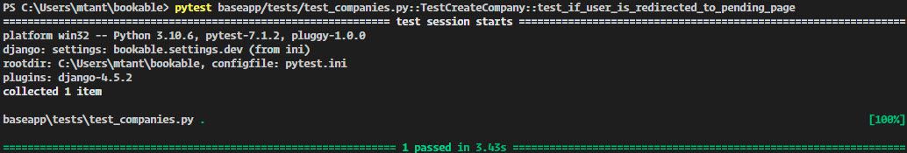

# Testing

## Automated Testing

I used the pytest framework for automated testing, which allowed me to test the application in various ways. pytest is run and installed on the development machine only. I used `pipenv install --dev pytest` with `pipenv install --dev pytest-django` and `pipenv install --dev model_bakery`. Together, there are no limits on what to test.

I tested URL's lookup and creating and retrieving a company and booking object.

 

Function [test_if_user_is_anonymous_returns_302](https://github.com/MTraveller/bookable/blob/6cc2f1afa470b110f850bcf89820cc8d9a56ab15/baseapp/tests/test_companies.py#L18):

-   Tests redirection of anonymous users to homepage.

    

 

Function [test_if_user_is_redirected_to_error_page](https://github.com/MTraveller/bookable/blob/6cc2f1afa470b110f850bcf89820cc8d9a56ab15/baseapp/tests/test_companies.py#L27):

-   Tests the render of company not valid if company add form is not valid.

    

 

Function [test_if_user_is_redirected_to_pending_page](https://github.com/MTraveller/bookable/blob/6cc2f1afa470b110f850bcf89820cc8d9a56ab15/baseapp/tests/test_companies.py#L42):

-   Tests if after company creation renders pending company template.

    

 

Function [test_if_company_does_not_exists_returns_200](https://github.com/MTraveller/bookable/blob/837ba4cf60ba1eaedc86eb192513aa7af6f5d9c0/baseapp/tests/test_bookings.py#L13):

-   Tests the render of company not valid if company does not exist.

    

 

Function [test_if_company_exists_returns_200](https://github.com/MTraveller/bookable/blob/b3d09bf4067b0afe95040c047db16ad21d5a4a95/baseapp/tests/test_bookings.py#L21):

-   Tests creation & retriving of company.

    

 

Function [test_if_booking_exists_returns_200](https://github.com/MTraveller/bookable/blob/b3d09bf4067b0afe95040c047db16ad21d5a4a95/baseapp/tests/test_bookings.py#L42):

-   Tests retriving of thank you page of booking object created.

    

 

## Manual Testing

I manually tested the features that directly affect the company and customer users. Everything works as expected.

### Company User

[company_image_upload_to_cloudinary](./docs/tests/manual_tests/company_image_upload_to_cloudinary.jpg)

-   When a company user registers and chooses a brand image on the form, the website will upload the image to Cloudinary.

 

[company_account_delete](./docs/tests/manual_tests/company_account_delete.jpeg)

-   When a company user presses the delete button in account info, the website will redirect the user to the above form; whether the user decides to delete the account or not, there's an option for both.

 

[company_account_delete_comfirmation](./docs/tests/manual_tests/company_account_delete_comfirmation.jpg)

-   When the company user deletes the account, the template will re-render and display a confirmation message that everything has been deleted for 5 seconds. Then, the website will redirect the user to the homepage.

 

[company_account_image_cloudinary_delete](./docs/tests/manual_tests/company_account_image_cloudinary_delete.gif)

-   When the company user is deleted, the website will also delete the user's image uploaded to Cloudinary.

 

### Customer User

[duplicate_booking](./docs/tests/manual_tests/duplicate_booking.jpeg)

-   If a user books with the same data_time twice, the user will see the message above. The user can either go back to change the date or go to their already made booking.

 

[all_spots_filled_booking](./docs/tests/manual_tests/all_spots_filled_booking.jpeg)

-   When all spots are taken for a particular date_time, the website will inform the user that all spots are taken.

 

[wrong_email_delete_booking](./docs/tests/manual_tests/wrong_email_delete_booking.jpeg)

-   If a user decides to cancel/delete a booking made previously, the user **must** use the same email as they used when they made the booking. If incorrect, the above message is presented to the user.

 

[correct_email_delete_booking](./docs/tests/manual_tests/correct_email_delete_booking.jpeg)

-   When the user successfully deletes a booking page will render the confirmation above.

 
